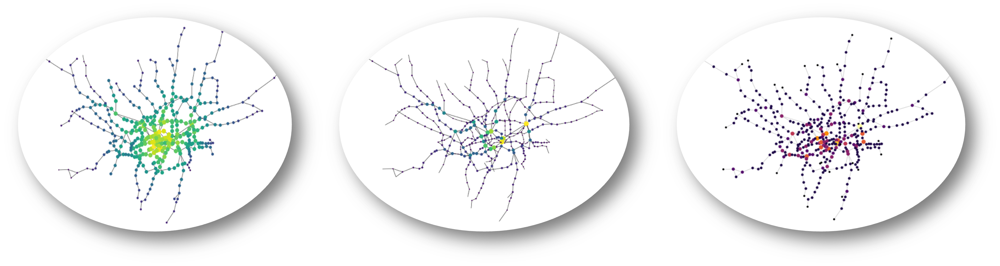

# Urban Simulation: A Network Analysis of the London Underground

#### This is an analysis of the resilience of London’s Underground. This analysis will be conducted in three parts:

- First I have only taken the topological network into consideration
- Secondly, I consider commuter flows and discuss the impact of the analysis on the number of people moving from one part of the city to another
- Finally, I will recompute commuter flows using spatial interaction models and discuss the vulnerability of the network

